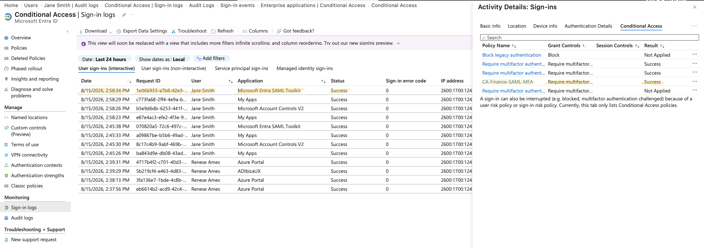

# Conditional Access – MFA Enforcement for Finance Group

## Overview

This lab demonstrates **Conditional Access (CA)** in Microsoft Entra ID by enforcing Multi-Factor Authentication (MFA) for members of the Finance group when accessing the **SAML Toolkit** enterprise application.

Conditional Access is a Zero Trust control that evaluates signals (user, group, application, location, device, risk) at sign-in time and applies access controls — such as requiring MFA or blocking access — before granting a session token.

---

## Objective

Demonstrate that:

- Members of **SG-Finance-Group** are required to complete MFA when signing into the **SAML Toolkit** application.
- Conditional Access correctly evaluates group membership and target application as scoping conditions.
- Access is only granted after both first-factor authentication and MFA are satisfied.
- Sign-in logs provide clear, auditable evidence of policy enforcement.

---

## Lab Environment

| User        | Department | Group             | Target Application | Policy                  |
| ----------- | ---------- | ------------------ | ------------------- | ------------------------ |
| Jane Smith  | Finance    | SG-Finance-Group   | SAML Toolkit         | CA-Finance-SAML-MFA      |

---

## Policy Configuration

**Policy name:** `CA-Finance-SAML-MFA`

| Setting | Value |
| --- | --- |
| Users | Include: SG-Finance-Group |
| Target resources | SAML Toolkit |
| Conditions | None (baseline policy) |
| Grant control | Require multi-factor authentication |
| Enable policy | On |

---

## Scenario

### Step 1 – Sign in as Jane Smith

Signed into the **SAML Toolkit** application as **Jane Smith**, a member of **SG-Finance-Group**.

### Step 2 – Complete First Factor Authentication

Jane entered her username and password. First-factor authentication succeeded.

### Step 3 – Complete MFA Challenge

Because Jane is a member of SG-Finance-Group and the target application matched the policy scope, Entra ID prompted Jane for MFA. Jane completed the MFA challenge successfully.

### Step 4 – Validate Enforcement in Sign-in Logs

Reviewed the sign-in event for Jane Smith in **Entra ID → Sign-in logs → Authentication details** and **Conditional access** tabs.

**Authentication details:**

| Date | Authentication Requirement | Succeeded | Result Detail |
| --- | --- | --- | --- |
| 2026-08-15T19:45:33Z | First factor | Yes | First factor requirement satisfied |
| 2026-08-15T19:45:33Z | MFA | Yes | MFA requirement satisfied |

**Conditional Access:**

| Policy Name | Result |
| --- | --- |
| CA-Finance-SAML-MFA | **Success** |



**Result**

✅ Sign-in succeeded. MFA was required and completed. Conditional Access policy evaluated to **Success**.

---

## Conditional Access Flow

```
        SG-Finance-Group
               │
               ▼
         Jane Smith (Finance)
               │
               ▼
     Sign in to SAML Toolkit
               │
               ▼
   CA-Finance-SAML-MFA Evaluated
               │
               ▼
      First Factor Satisfied ✅
               │
               ▼
        MFA Challenge Issued
               │
               ▼
       MFA Completed ✅
               │
               ▼
      Policy Result: Success
               │
               ▼
        Access Granted ✅
```

---

## Security Principles Demonstrated

- Conditional Access (CA)
- Multi-Factor Authentication (MFA)
- Zero Trust ("never trust, always verify")
- Group-Based Policy Scoping
- Defense in Depth (authentication + authorization + contextual control)
- Access Control Validation via Sign-in Logs

---

## Key Takeaways

This exercise demonstrates how Microsoft Entra ID uses Conditional Access to add a contextual, policy-driven layer of security on top of standard authentication. Even though Jane successfully authenticated with a valid username and password, access to the SAML Toolkit application was not granted until she also satisfied the MFA requirement enforced by the CA-Finance-SAML-MFA policy.

This layered approach — authentication, authorization (group/app assignment), and Conditional Access — reduces the risk of unauthorized access from compromised credentials, since a password alone is no longer sufficient to gain access to sensitive applications.

Sign-in logs provide auditable proof that the policy was evaluated, scoped correctly to the Finance group, and enforced as intended.

---

## Skills Demonstrated

- Microsoft Entra ID
- Identity and Access Management (IAM)
- Conditional Access Policy Design
- Multi-Factor Authentication (MFA) Enforcement
- Group-Based Access Scoping
- Sign-in Log Analysis
- Zero Trust Security Principles
- Access Control Validation
