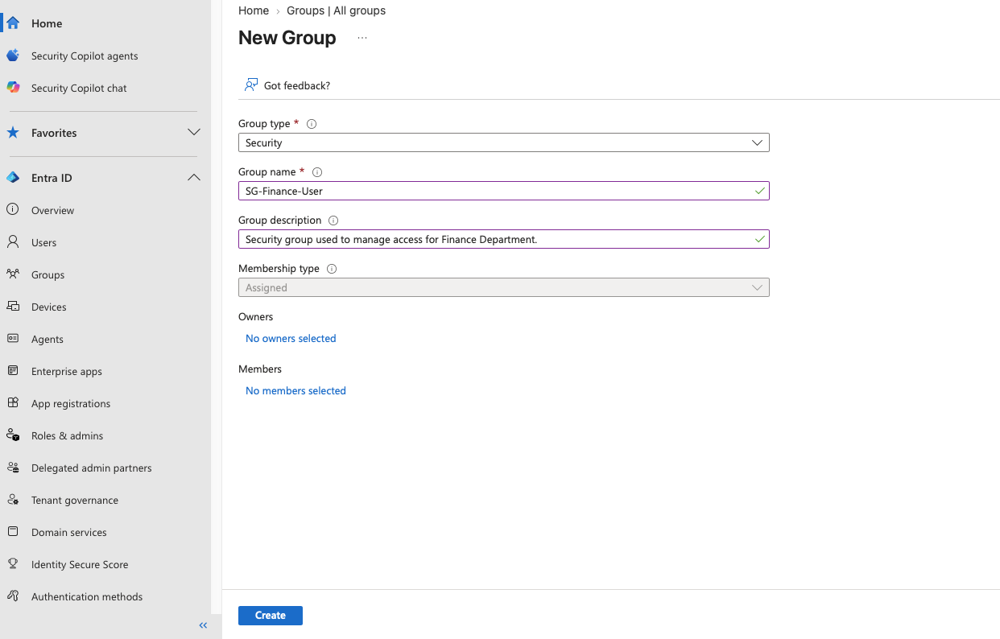
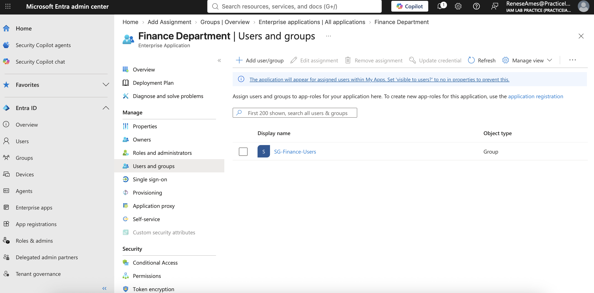
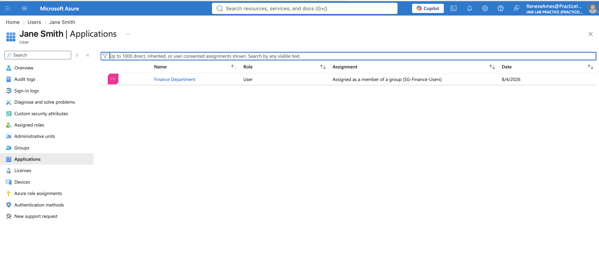

# Group-Based Application Access

## Objective

This exercise demonstrates how Microsoft Entra ID security groups can be used to manage access to enterprise applications.

Instead of assigning permissions directly to individual users, application access is granted through membership in a security group.

## Scenario

Jane Smith is a Financial Analyst in the Finance department.

A security group named **SG-Finance-Users** was created to represent Finance employees.

A fictional Enterprise Application named **Finance Application** was created.

The **SG-Finance-Users** security group was assigned to the Finance Application.

Since Jane Smith is a member of the security group, she automatically inherits access to the application.

## Implementation

### Security Group

- SG-Finance-Users

### User

- Jane Smith

### Enterprise Application

- Finance Application

### Access Assignment

Finance Application

↓

Assigned to

↓

SG-Finance-Users

↓

Contains

↓

Jane Smith

↓

Application Access Granted

## Result

Jane Smith successfully accessed the Finance Application through her membership in the SG-Finance-Users security group.

This demonstrates centralized application access management using Microsoft Entra ID security groups.

## IAM Concepts Demonstrated

- Identity Management
- Group-Based Access Control
- Role-Based Access Control (RBAC)
- Least Privilege
- Enterprise Applications
- Authorization
