# Joiner–Mover–Leaver (JML) Identity Lifecycle Management

## Objective

Demonstrate the Joiner–Mover–Leaver (JML) identity lifecycle using Microsoft Entra ID.

The JML lifecycle manages a user's identity and access throughout their employment:

```text
JOINER
New Employee
     ↓
Account Provisioning
     ↓
Group & Application Access
     ↓
MFA / Conditional Access


MOVER
Role or Department Change
     ↓
Access Review
     ↓
Remove Previous Access
     ↓
Grant New Access


LEAVER
Employee Departure
     ↓
Disable Account
     ↓
Remove Access
     ↓
Revoke Authentication
```

Microsoft Entra identifies these three lifecycle phases as Joiner, Mover, and Leaver. Lifecycle Workflows can automate tasks associated with each phase.

---

# 1. Joiner — New Employee

## Scenario

A new employee, **Dorothy Clark**, joins the organization as a Financial Analyst.

Jane's initial attributes are:

| Attribute      | Value                        |
| -------------- | ---------------------------- |
| Name           | Dorothy Clark                   |
| Department     | Finance                      |
| Job Title      | Financial Advisor            |
| Security Group | `SG-Finance-Users`           |
| Application    | Microsoft Entra SAML Toolkit |
| Authentication | MFA                          |

The objective is to provision Jane with the access required for her Finance role.

---

## 1.1 Create the User

Navigate to:

**Microsoft Entra ID → Users → New user**

Create:

`Dorothy Clark`

Configure the appropriate user attributes, including:

* First Name
* Last Name
* Department
* Job Title

Capture a screenshot of the completed user profile.

**Screenshot:**

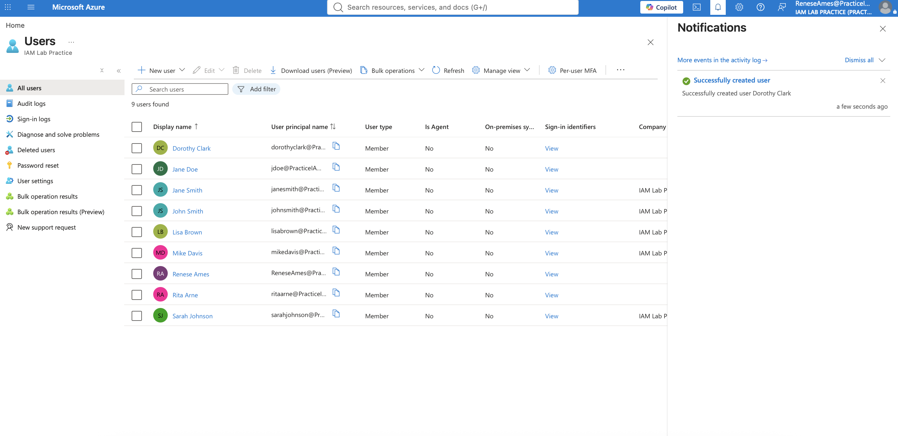

---
## 1.2 Add the User to the Finance Group

Navigate to:

**Microsoft Entra ID → Groups → SG-Finance-Users → Members**

Add:

`Dorothy Clark`

The group provides the user's Finance-related access.

```text
Dorothy Clark
     ↓
SG-Finance-Users
     ↓
Finance Access
```

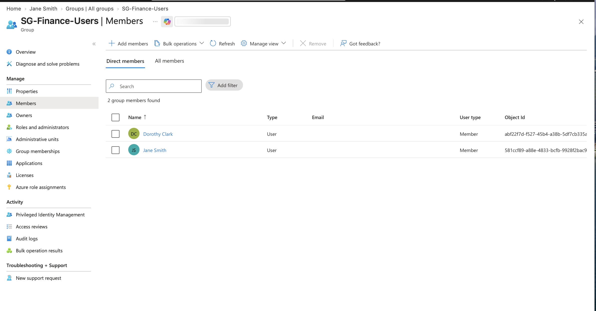

---

## 1.3 Assign Application Access

Navigate to:

**Enterprise applications → Microsoft Entra SAML Toolkit → Users and groups**

Assign the appropriate Finance group/user.

Verify that Dorothy is authorized to access the application.

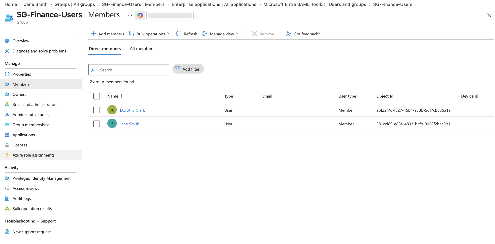

---

## 1.4 Enforce MFA

The Conditional Access policy:

`CA-Finance-SAML-MFA`

targets:

`SG-Finance-Users`

and requires MFA when accessing the SAML Toolkit.

The resulting access model is:

```text
Dorothy Clark
     ↓
SG-Finance-Users
     ↓
SAML Toolkit
     ↓
CA-Finance-SAML-MFA
     ↓
MFA Required
     ↓
Access Granted
```
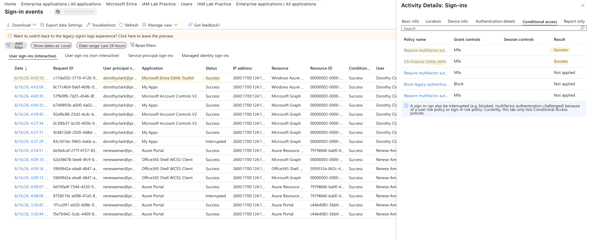

---

## Joiner Validation

The Joiner process is complete when:

* [ ] User account exists
* [ ] User attributes are populated
* [ ] User belongs to the appropriate security group
* [ ] Required application access is assigned
* [ ] MFA is enforced
* [ ] User can access authorized resources
* [ ] User cannot access unauthorized resources

---

# 2. Mover — Employee Changes Roles

## Scenario

Dorothy Clark changes roles from:

**Financial Analyst → Systems Analyst**

and moves from:

**Finance → IT**

This change requires an access review.

The objective is to remove Finance access and provide the appropriate IT access.

Microsoft identifies employee job-profile changes and group-membership changes as Mover scenarios.

---

## 2.1 Update User Attributes

Navigate to:

**Microsoft Entra ID → Users → Dorothy Clark → Properties**

Update:

| Attribute  | Previous          | New             |
| ---------- | ----------------- | --------------- |
| Department | Finance           | IT              |
| Job Title  | Financial Analyst | Systems Analyst |


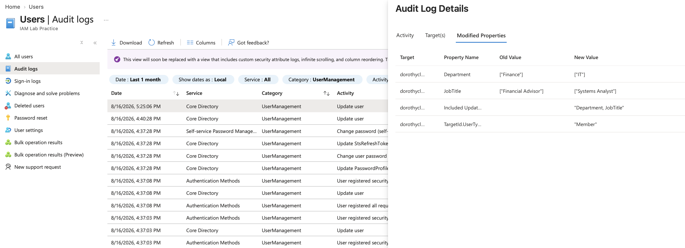

---

## 2.2 Remove Finance Group Membership

Navigate to:

**Groups → SG-Finance-Users → Members**

Remove:

`Dorothy Clark`

This removes the group-based Finance access associated with the previous role.

```text
BEFORE

Dorothy Clark
    ↓
SG-Finance-Users
    ↓
Finance Access


AFTER

Dorothy Clark
    ↓
SG-IT-Users
    ↓
IT Access
```


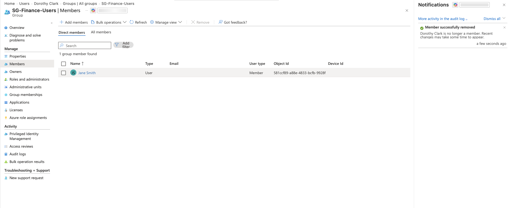

---

## 2.3 Add IT Group Membership

Navigate to:

**Groups → SG-IT-Users → Members**

Add:

`Dorothy Clark`

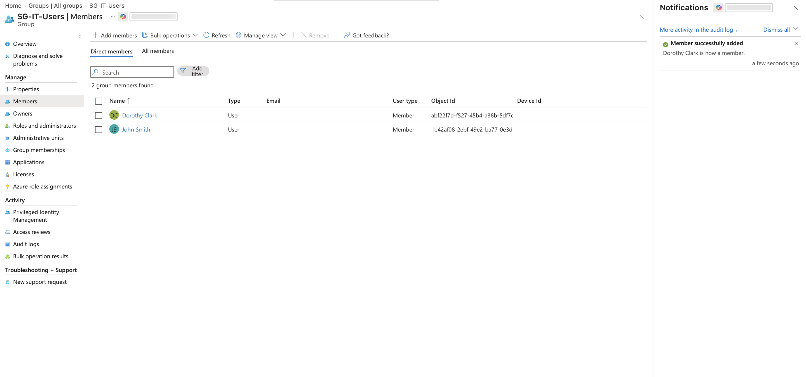

---

## 2.4 Validate Application Access

Test Dorothy's access to the SAML Toolkit.

Because Dorothy is no longer a member of:

`SG-Finance-Users`

the Finance-specific access and Conditional Access policy should no longer apply to her based on that group membership.

Review the Entra sign-in logs to confirm the policy evaluation.

This demonstrates **least privilege** and access modification during a role change.

---

## Mover Validation

The Mover process is complete when:

* [ ] Department is updated
* [ ] Job title is updated
* [ ] Previous security-group membership is removed
* [ ] New security-group membership is added
* [ ] Previous application access is reviewed
* [ ] New application access is validated
* [ ] Conditional Access policies are reevaluated
* [ ] User has access appropriate to the new role

---

# 3. Leaver — Employee Departure

## Scenario

Dorothy Clark leaves the organization.

The objective is to immediately prevent Dorothy from authenticating and remove her access to organizational resources.

Microsoft identifies disabling accounts, removing group memberships, removing licenses, and removing application/access-package assignments as examples of Leaver tasks.

---

## 3.1 Disable the User Account

Navigate to:

**Microsoft Entra ID → Users → Dorothy Clark**

Select:

**Block sign-in → Yes**

This prevents the account from being used for new authentication.

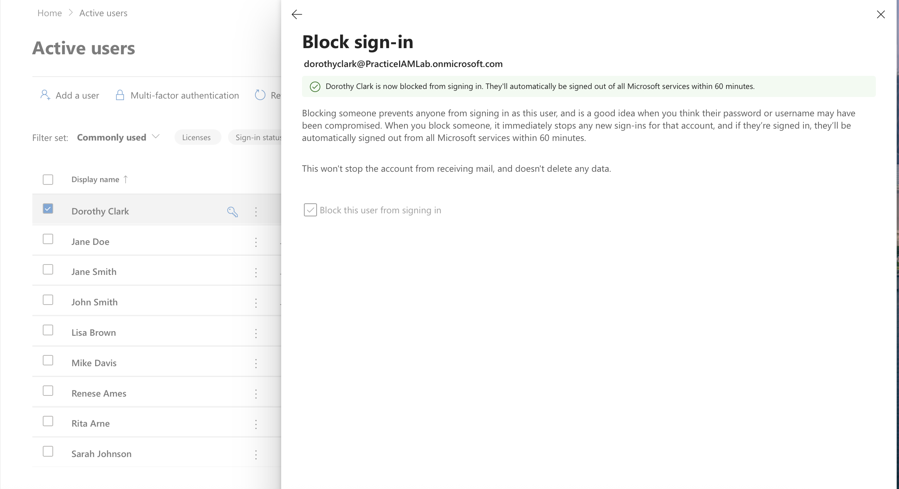

---

## 3.2 Remove Group Membership

Remove Dorothy from SG-IT-Users organizational security groups.

This removes group-based authorization.

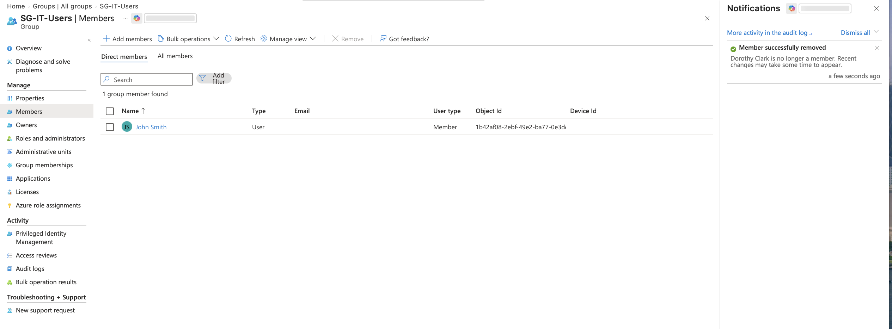

---

## 3.3 Remove Application Access

Navigate to:

**Enterprise applications → Microsoft Entra SAML Toolkit → Users and groups**

Verify that Dorothy no longer has application access.

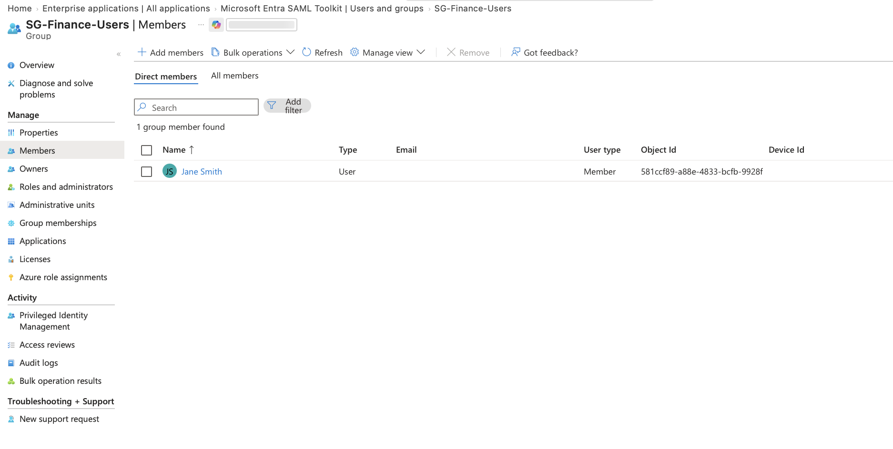

---

## 3.4 Verify Authentication Is Blocked

Attempt to sign in as Dorothy.

The authentication attempt should fail because the account has been disabled.

Then review:

**Microsoft Entra ID → Monitoring & health → Sign-in logs**

Locate the failed authentication attempt.

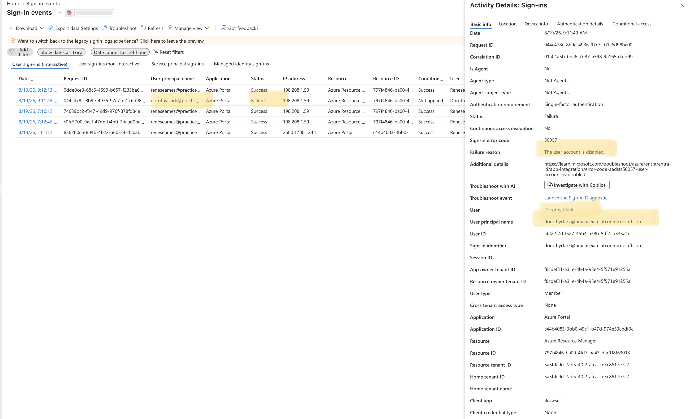

This provides evidence that the leaver process successfully prevented authentication.

---

# 4. JML Validation Matrix

| Lifecycle | User State        | Group Action            | Application Access | Expected Result        |
| --------- | ----------------- | ----------------------- | ------------------ | ---------------------- |
| Joiner    | New employee      | Add Finance group       | Grant SAML access  | Access + MFA           |
| Mover     | Finance → IT      | Remove Finance / Add IT | Reevaluate access  | Appropriate IT access  |
| Leaver    | Employee departed | Remove groups           | Remove access      | Authentication blocked |

---

# 5. IAM Controls Demonstrated

This JML scenario demonstrates:

### Identity Lifecycle Management

Users receive, change, and lose access according to their employment lifecycle.

### Provisioning

New users receive the accounts, groups, and applications required for their role.

### Deprovisioning

Users leaving the organization have their access removed.

### RBAC

Security-group membership is used to associate users with role-based access.

### Least Privilege

When Dorothy moves from Finance to IT, Finance access is removed rather than allowing her previous permissions to accumulate.

### MFA

Finance users are required to complete MFA when accessing the SAML Toolkit.

### Conditional Access

Access policies are evaluated based on user/group and application scope.

### Auditing

Sign-in logs and workflow history provide evidence that access controls operated as expected.

---

# 6. Recommended GitHub Structure

Add the following to the IAM lab:

```text
documentation/
├── joiner.md
├── mover.md
├── leaver.md
└── jml-lifecycle.md

screenshots/
└── jml/
    ├── joiner/
    │   ├── joiner-user-created.png
    │   ├── joiner-finance-group-membership.png
    │   ├── joiner-saml-application-access.png
    │   └── joiner-mfa-success.png
    │
    ├── mover/
    │   ├── mover-user-attributes.png
    │   ├── mover-finance-access-removed.png
    │   ├── mover-it-group-membership.png
    │   └── mover-application-access.png
    │
    └── leaver/
        ├── leaver-account-disabled.png
        ├── leaver-session-revocation.png
        ├── leaver-group-access-removed.png
        ├── leaver-application-access-removed.png
        └── leaver-signin-blocked.png
```

---

# 7. Evidence-Based JML Demonstration

The completed lab should tell one continuous story:

```text
                    JOINER
                       │
                       ▼
              Dorothy Clark Created
                       │
                       ▼
              SG-Finance-Users
                       │
                       ▼
             SAML Toolkit Access
                       │
                       ▼
                   MFA
                       │
                       ▼
                Access Granted
                       │
                       ▼
                  MOVER
                       │
                       ▼
             Finance → IT
                       │
             ┌─────────┴─────────┐
             ▼                   ▼
      Remove Finance         Add IT Group
          Access                 Access
             │                   │
             └─────────┬─────────┘
                       ▼
                 Access Review
                       │
                       ▼
                  LEAVER
                       │
                       ▼
              Disable Account
                       │
                       ▼
              Revoke Sessions
                       │
                       ▼
              Remove Groups
                       │
                       ▼
             Remove App Access
                       │
                       ▼
             Authentication Blocked
```

## Conclusion

This JML implementation demonstrates how IAM controls can follow an employee throughout the identity lifecycle.

The Joiner process establishes the user's identity and required access. The Mover process modifies access when the user's organizational role changes. The Leaver process removes access and prevents further authentication when the user's employment ends.

Microsoft Entra Lifecycle Workflows can automate many of these tasks through predefined workflow templates and tasks, including adding users to groups, assigning licenses, disabling accounts, removing group memberships, and removing access package assignments.

For a production implementation, workflow execution should also be monitored through workflow history and audit logs. Microsoft records Lifecycle Workflow processing events in its audit capabilities, providing evidence for operational monitoring and compliance.

For this lab, the screenshots and validation tests above provide evidence of the complete **Joiner → Mover → Leaver** lifecycle.


