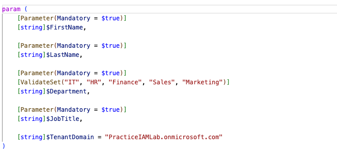
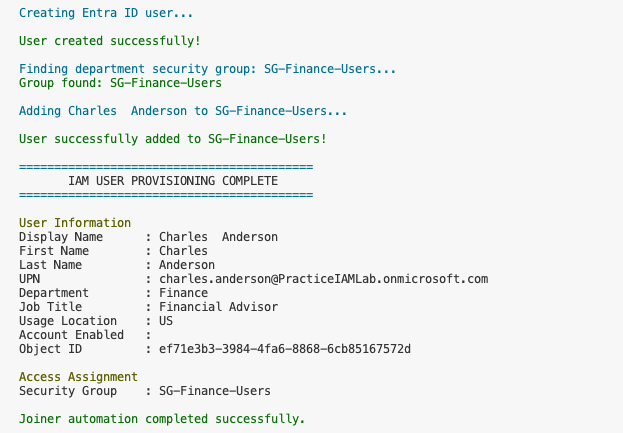
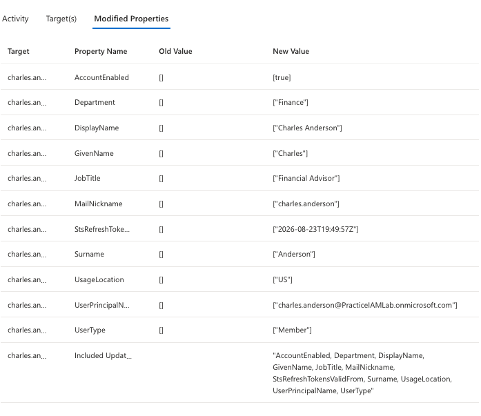
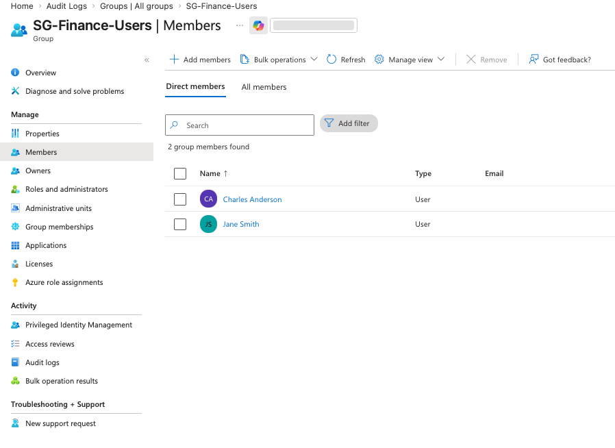
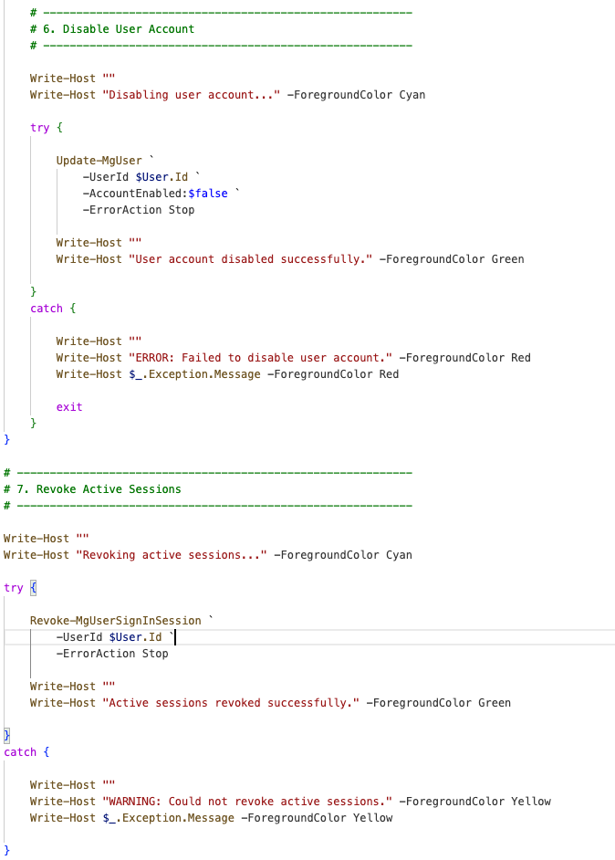
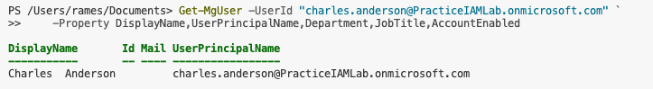
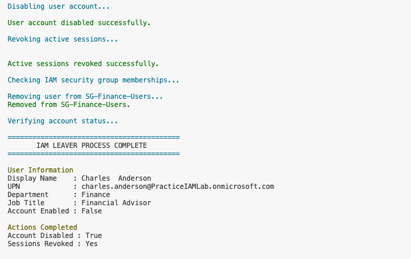
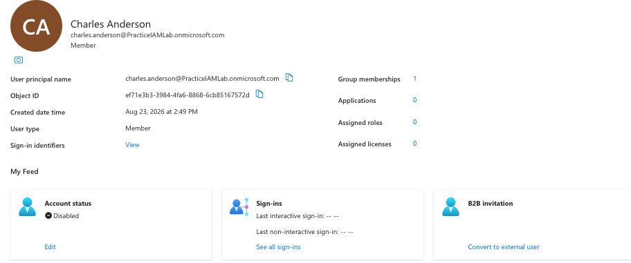
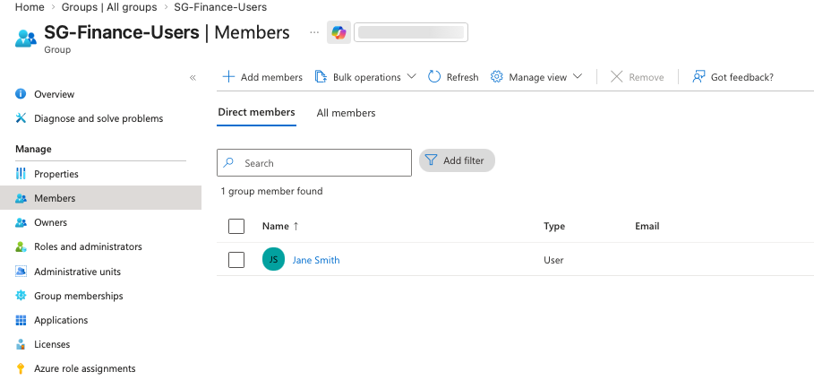

# PowerShell IAM Automation

## Overview

This lab demonstrates automated identity lifecycle management
using Microsoft Graph PowerShell.

The automation covers:

- User provisioning
- Attribute assignment
- Department-based group assignment
- Account disabling
- Session revocation
- Group membership removal

## Prerequisites

- Microsoft Entra ID
- Microsoft Graph PowerShell
- Appropriate Microsoft Graph permissions
- IAM security groups

## Joiner Automation

### Step 1 — Connect to Microsoft Graph

### Step 2 — Create User

The create-user.ps1 script accepts reusable parameters for
first name, last name, department, and job title.

### Step 3 — Execute Provisioning

### Step 4 — Verify User Attributes

### Step 5 — Verify Group Assignment

## Leaver Automation

### Step 1 — Disable User

The disable-user.ps1 script disables the account, revokes
active sessions, and removes the user from IAM department
security groups.

### Step 2 — Verify User Before Deprovisioning

### Step 3 — Execute Leaver Automation

### Step 4 — Verify Account Disabled

### Step 5 — Verify Access Removal

## Results

The automation successfully demonstrates:

- Automated identity provisioning
- Attribute assignment
- Group-based access assignment
- Account deactivation
- Session revocation
- Group-based access removal

## IAM Lifecycle

Joiner:

New Employee → Create Account → Assign Attributes → Assign Group → Access

Leaver:

Employee Departure → Disable Account → Revoke Sessions → Remove Groups → Access Removed
