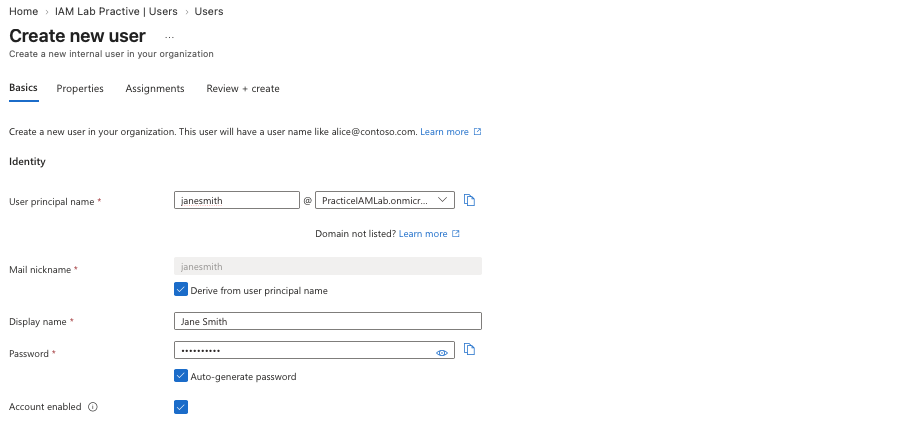
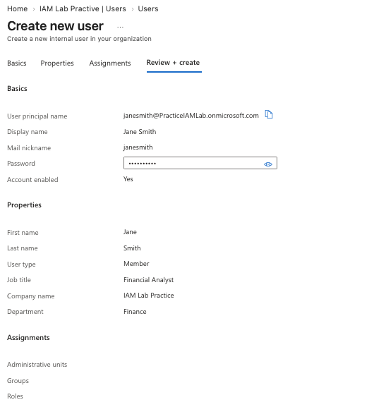
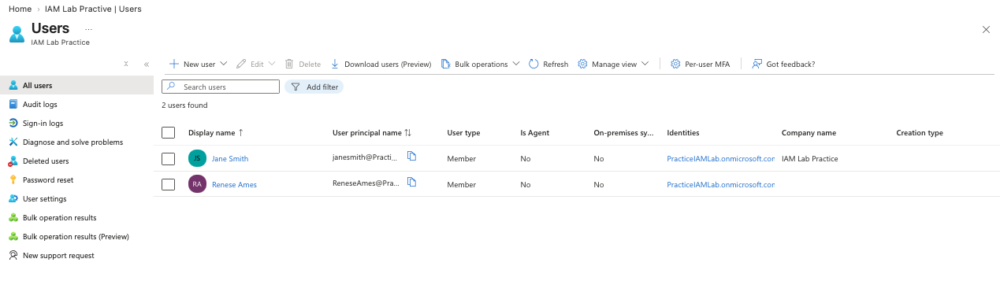

# User Provisioning – Microsoft Entra ID

## Objective

The objective of this lab was to demonstrate the process of provisioning a fictional user in Microsoft Entra ID.

## User Information

- Name: Jane Smith
- Username: jane.smith@PracticeIAMLab.onmicrosoft.com
- Department: Finance
- Job Title: Financial Analyst

## Step 1: Create the User

I created a fictional user account in Microsoft Entra ID using the New User workflow.

## Step 2: Configure User Details

I configured the user's department and job title to reflect their assigned role within the organization.

## Step 3: Verify User Creation

I verified that the fictional user account was successfully created and appeared in the Microsoft Entra ID user directory.

## Outcome

The fictional user was successfully provisioned and configured with the appropriate identity attributes. This demonstrates the basic user provisioning process within Microsoft Entra ID.
